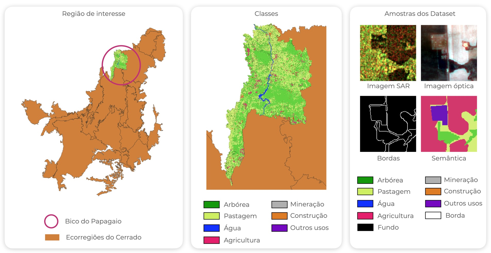

# CerraData-4C
A quarta versão do Biome Cerrado Dataset (CerraData-4) se destaca das versões anteriores por se tratar de um dataset multi-modality, portanto, composto por imagens ópticas e de abertura sintética de radar (SAR). Este repositório apresenta sua distribuições rotulada (classificada), por isso CerraData-4C, com a finalidade de treinar modelos de aprendizado profundo de modo supervisionado. Dessa maneira, baseado no mapa temático de uso e cobertura da terra produzido Projeto TerraClass relativos ao ano de 2022, seleciou-se 7 entre as demais classes, na ecorregião do Bico do Papagaio, tal como ilustrado na Figura abaixo. 

Diferente das versões anteriores que o conjunto de imagens é formado por imagens do satélite CBERS-4A, esta versão experimental conta com 17 cenas do Sentinel-2 e 7 cenas do Sentinel-1. Cada cena de seu respectivo satélite é composto por todas as bandas disponíveis, pre-processadas para 10 metros de resolução espacial, portanto, aquelas bandas cuja resolução espacial é maior do que 10 metros foram down-sampling para 10 metros. Além disso, estes rasters foram recortados em patches de tamanhos iguais de 128x128 pixels. Ao total, há 30.322 patches para cada modalidade de dado. Atualmente, esta é uma versão experimental e não será disponibilizada publicamente para a comunidade científica até os experimentos serem finalizados. Contudo, um dos principais objetivos é fazê-lo de acesso aberto a todos interessados em utilizar este material para treinar modelos de aprendizado profundo multi-tarefa.

